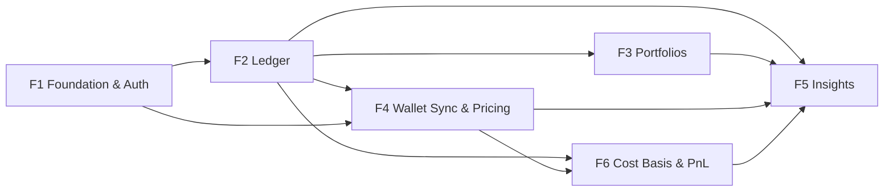

# Nestfolio MVP — Project Plan

**Epic:** Nestfolio — Personal Wealth Command Center
**Source spec:** `thoughts/shared/specs/2026-06-07-nestfolio.md`
**Date:** 2026-06-07
**Stack:** Next.js (App Router, backend in API routes) · Supabase (Postgres + Auth + RLS) · Vercel · Recharts

---

## 1. Project Overview

### Feature Summary
A single-user personal wealth tracker. Reads a public BNB wallet (read-only),
combines on-chain holdings with manually entered assets and liabilities, and
presents one unified net-worth view with flexibly nested portfolios,
all-levels rebalancing, history charts, monthly reviews, and projections.

### Success Criteria
- Dashboard loads net worth + breakdown in < 2s.
- BNB balances sync from a public address with USD values.
- `Net Worth = Assets − Liabilities` always reconciles.
- Rebalancing shows exact buy/sell amounts at every portfolio level.
- History chart renders net worth trend from stored snapshots.

### Key Milestones (no dates — dependency-ordered)
1. **M1 Foundation** — scaffold, schema, auth.
2. **M2 Ledger** — accounts, transactions, holdings (the engine).
3. **M3 Portfolios** — nesting, sources, allocation/rebalancing.
4. **M4 Wallet Sync & Pricing** — BNB read-only sync, PriceProvider, Ondo resolution.
5. **M5 Cost Basis & PnL** — classifier, ledger, realized/unrealized/total PnL.
6. **M6 Insights** — dashboard (with PnL), liabilities, history, projection, monthly review.

### Risk Assessment
| Risk | Impact | Mitigation |
|------|--------|-----------|
| ~~Portfolio API free-tier limits~~ **RESOLVED** | Sync gaps | **NodeReal MegaNode** free tier covers BSC at $0 for one user; behind `WalletProvider`. Moralis ended free usage 2026-09-01; Etherscan V2 is NOT free for BSC. (Open Q #2 closed) |
| ~~Tokenized-stock contracts not resolving~~ **RESOLVED** | Wrong stock values | Stocks are **Ondo** BEP-20 (`…on` suffix) → strip to equity ticker; manual override. (Open Q #4 closed) |
| **Tokenized-stock DEX price is unreliable** (thin liquidity) | Net worth overstated ~2.5× | **Never** value stocks by token/DEX price; use the underlying equity feed (EN4.3). Sanity-check DEX-vs-real divergence. |
| **Cost basis is mostly off-chain** (1-leg Ondo deliveries paid via Binance) | Wrong PnL | Price each delivery at historical equity price (Option A); cash-reconciliation guard; optional Binance import for exact fills. |
| Equity price feed (yahoo-finance2) is unofficial | Price gaps / throttling | Cache + refresh on schedule; keyed fallback (Finnhub live ✅, Twelve Data historical). |
| Gold/PAXG pricing accuracy | Net worth drift | Use spot per-gram feed; store price source on snapshot |
| Recursive rebalancing math errors | Bad buy/sell advice | Heavy unit tests (T3.2); define relative-vs-absolute targets (Open Q #5) |
| RLS misconfiguration | Data leak | RLS on every table; auth-isolation E2E test (T1.1) |

> **Feasibility validated 2026-06-07** on a real wallet — see
> `pnl-and-pricing-method.md`. All inputs (transactions, holdings, buy prices,
> tokenized stocks, PnL) confirmed reachable.
>
> **Async/persistence design** — `sync-and-persistence-design.md`. Two-speed model:
> transactions + historical prices are fetched once and stored; sync appends only
> the delta; realized PnL recomputes on new trades, unrealized on a live-price TTL.
> Dashboard reads last-known from the DB instantly.

---

## 2. Work Item Hierarchy

```mermaid
graph TD
    E[Epic: Nestfolio MVP] --> F1[Feature: Platform Foundation & Auth]
    E --> F2[Feature: Core Ledger / Transaction Engine]
    E --> F3[Feature: Portfolios, Sources & Allocation]
    E --> F4[Feature: BNB Wallet Sync & Pricing]
    E --> F5[Feature: Insights & Dashboard]
    E --> F6[Feature: Cost Basis & PnL]

    F1 --> EN11[Enabler: Next.js + Vercel scaffold]
    F1 --> EN12[Enabler: Supabase schema + RLS]
    F1 --> EN13[Enabler: Google OAuth]
    F1 --> S11[Story: Sign in with Google]
    F1 --> T11[Test: Auth + RLS isolation]

    F2 --> EN21[Enabler: Account entity + CRUD]
    F2 --> EN22[Enabler: Transaction engine]
    F2 --> EN23[Enabler: Holding entity + balances]
    F2 --> S21[Story: Create accounts]
    F2 --> S22[Story: Log transaction]
    F2 --> S23[Story: Log categorized expense]
    F2 --> S24[Story: Transaction notes]
    F2 --> T21[Test: Engine reconcile]

    F3 --> EN31[Enabler: Nested portfolio + rollup]
    F3 --> EN32[Enabler: Asset source + wallet_ref]
    F3 --> EN33[Enabler: Allocation/rebalance engine]
    F3 --> S31[Story: Nested portfolios]
    F3 --> S32[Story: Assign holdings]
    F3 --> S33[Story: Set targets per level]
    F3 --> S34[Story: Drift + buy/sell advice]
    F3 --> T31[Test: Rollup + rebalance math]

    F4 --> EN41[Enabler: Provider integration - Moralis]
    F4 --> EN42[Enabler: Incremental sync + persistence]
    F4 --> EN43[Enabler: PriceProvider + price caches]
    F4 --> EN44[Enabler: Tokenized-stock resolution]
    F4 --> EN45[Enabler: Async sync orchestrator]
    F4 --> S41[Story: Sync BNB address]
    F4 --> T41[Test: Sync + graceful failure]

    F6 --> EN61[Enabler: Tx classifier + reconciliation]
    F6 --> EN62[Enabler: Cost-basis ledger]
    F6 --> EN63[Enabler: PnL engine]
    F6 --> S61[Story: See realized/unrealized/total PnL]
    F6 --> T61[Test: PnL math + reconciliation]

    F5 --> EN51[Enabler: Snapshot job]
    F5 --> EN52[Enabler: Net worth aggregation]
    F5 --> S51[Story: Net Worth Dashboard]
    F5 --> S52[Story: Liabilities]
    F5 --> S53[Story: History chart]
    F5 --> S54[Story: Allocation pie]
    F5 --> S55[Story: Future projection]
    F5 --> S56[Story: Monthly review]
    F5 --> T51[Test: Aggregation + dashboard E2E]
```

---

## 3. Dependency Graph & Critical Path

- **Critical path:** F1 → F2 → F3 → F5.
- **Parallel:** F4 can start once F2 (holdings) and F1 (auth/schema) land.
- **F6 (PnL)** runs after F4 (needs provider + pricing + resolution); feeds F5.
- **Blocking rule:** nothing starts before F1; F5 is last (consumes all incl. PnL).

---

## 4. Priority & Value Matrix

| Item | Priority | Value | Labels |
|------|----------|-------|--------|
| F1 Foundation & Auth | P0 | High | `priority-critical` `value-high` `infrastructure` |
| F2 Ledger | P0 | High | `priority-critical` `value-high` `backend` |
| F3 Portfolios & Allocation | P1 | High | `priority-high` `value-high` `fullstack` |
| F4 Wallet Sync & Pricing | P1 | High | `priority-high` `value-high` `backend` `integration` |
| F6 Cost Basis & PnL | P1 | High | `priority-high` `value-high` `backend` `integration` |
| F5 Insights & Dashboard | P1 | High | `priority-high` `value-high` `frontend` |
| Alerts (post-MVP) | P2 | Medium | `priority-medium` `value-medium` |
| Snapshot-frequency config (post-MVP) | P3 | Low | `priority-low` `value-low` |

---

## 5. Estimates

| Feature | T-shirt | Story points (sum) |
|---------|---------|--------------------|
| F1 Platform Foundation & Auth | M | 16 |
| F2 Core Ledger | L | 21 |
| F3 Portfolios & Allocation | L | 26 |
| F4 BNB Wallet Sync & Pricing | L | 25 |
| F6 Cost Basis & PnL | M | 16 |
| F5 Insights & Dashboard | L | 29 |
| **Total** | **XL** | **~133** |

Per-item points are in `issues-checklist.md`. Fibonacci scale (1/2/3/5/8/13).
XL total signals this should ship feature-by-feature, not big-bang.

---

## 6. GitHub Project Board

### Columns (Kanban)
`Backlog` → `Sprint Ready` → `In Progress` → `In Review` → `Testing` → `Done`

### Custom fields
- **Priority:** P0–P3
- **Value:** High / Medium / Low
- **Component:** Frontend / Backend / Infrastructure / Integration / Testing
- **Estimate:** story points
- **Feature:** parent feature ref
- **Epic:** Nestfolio MVP

### Labels
`epic` `feature` `user-story` `enabler` `test`
`priority-critical|high|medium|low` `value-high|medium|low`
`frontend` `backend` `fullstack` `infrastructure` `integration` `database`

---

## 7. Definition of Ready / Done

**Ready:** acceptance criteria written · dependencies linked · estimate set · component + priority labels applied.

**Done (story):** acceptance criteria met · code review approved · unit + integration tests passing · UX implemented · RLS enforced where data is touched.

**Done (feature):** all stories + enablers done · integration tests pass · dashboard/flows verified · no P0/P1 bugs open.

---

## 8. Suggested Build Sequence

1. **F1** — scaffold, schema, RLS, Google OAuth. (Unblocks all.)
2. **F2** — Account + Transaction engine + Holdings. (The core; everything reads from it.)
3. **F4** — Wallet sync + pricing (Moralis + PriceProvider + Ondo resolution) once F2 holdings exist.
4. **F6** — Cost basis & PnL (classifier + ledger + PnL engine) on top of F4.
5. **F3** — Portfolios, sources, allocation/rebalancing on top of holdings.
6. **F5** — Dashboard, liabilities, history, projection, monthly review (shows PnL).

Post-MVP: alerts, configurable snapshot frequency.
